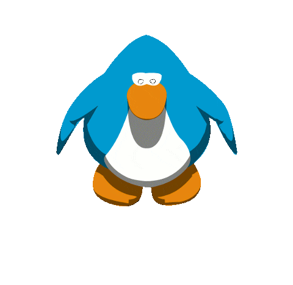

<div align="center">
  
  
<div align="center">
  
</div>

<a href="https://git.io/typing-svg"></a>

[](https://github.com/HiImGhost666)

</div>

<!-- Línea divisora animada -->


##  Sobre Mí

```javascript
hola.mundo(console.log)
```

🔹 **Estudiante**: **Java, JavaScript, HTML, PHP** y otros lenguajes.  
🔹 **Experimentador** - Si se puede romper, lo voy a intentar  
🔹 **Enfoque práctico**: Disfruto experimentar y aplicar lo que aprendo en proyectos reales (Me ayuda ChatGPT).  


##  Tech Stack

<details open>
<summary><b>🔥 Lenguajes & Frameworks</b></summary>
<br>


</details>

<details open>
<summary><b>🎨 Frontend</b></summary>
<br>


</details>

<details>
<summary><b>⚙️ Backend</b></summary>
<br>


*En progreso...*

</details>

<details open>
<summary><b>🗄️ Bases de Datos</b></summary>
<br>


</details>

<details open>
<summary><b>🛠️ Herramientas & Plataformas</b></summary>
<br>


</details>

<details>
<summary><b>🤖 IA & Diseño</b></summary>
<br>


</details>


##  Proyectos Destacados

<div align="center">

<table>
<tr>
<td width="50%">

### 🔍 [ScannerV4](https://github.com/HiImGhost666/scannerv4)
Herramienta de escaneo avanzada con interfaz

[](https://github.com/HiImGhost666/scannerv4)

</td>
<td width="50%">

### 🏝️ [Switch Island](https://github.com/HiImGhost666/SwitchIsland)
Página web con juegos de la Nintendo Switch

[](https://github.com/HiImGhost666/SwitchIsland)

</td>
</tr>
<tr>
<td width="50%">

### ☕ [Programación Java](https://github.com/HiImGhost666/Programacion-Java)
Colección de ejercicios y proyectos en Java, PHP y otros lenguajes

[](https://github.com/HiImGhost666/Programacion-Java)

</td>
<td width="50%">

### 🥖 [Le Baguettes](https://github.com/HiImGhost666/LeBaguettes)
Un montón de bocadillos girando

[](https://github.com/HiImGhost666/LeBaguettes)

</td>
</tr>
</table>

</div>


##  Estadísticas de GitHub

<div align="center">
  
  
</div>

<div align="center">
  
</div>


##  Logros & Trofeos

<div align="center">


</div>


##  Actividad Reciente

<!--START_SECTION:activity-->
<!--END_SECTION:activity-->

<div align="center">

### 📊 Gráfico de Contribuciones


</div>


<div align="center">


<a href="https://git.io/typing-svg"></a>


<div align="center">
  


</div>
